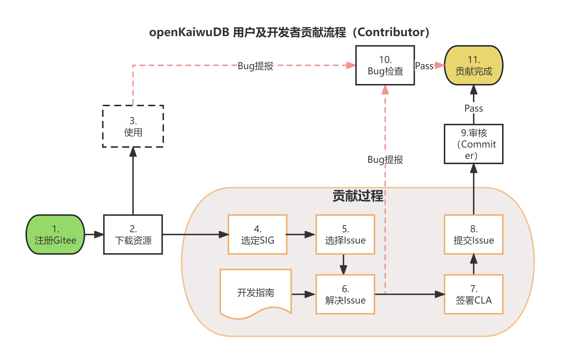

# KaiwuDB用户及开发者贡献流程

## [**注册Gitee账号**](https://gitee.com/signup?redirect_to_url=%2F)（如果已有，则忽略此步骤）
 KaiwuDB源代码托管在Gitee（码云）上，请参考[Gitee官方文章](http://https://gitee.com/help/articles/4113)注册您的Gitee账户类型。

## **选定SIG**
 为促进开源社区工作开展和交流，KaiwuDB设立5个SIG（Special Interest Group）特别兴趣小组。欢迎您才加入并参与贡献，您可以在 SIG 对应的代码仓库上提交 Issue，参与 Issue 讨论，提交 Pull Request，参与代码检视等。如下SIG兴趣列表供你选择：

| SIG                              | 职责                                                        | 联系方式                   |
|----------------------------------|-----------------------------------------------------------|------------------------|
| SQL engine SIG（计算引擎小组）           | 负责KaiwuDB社区SQL计算引擎的开发和维护                                  | sql@kaiwudb.org.cn     |
| Storage engine SIG（存储引擎小组）       | 负责KaiwuDB社区存储引擎的开发和维护                                     | storage@kaiwudb.org.cn |
| AIoT SIG（多模时序技术小组）               | 负责KaiwuDB社区数据库相关AI和IoT技术的开发和维护                            | aiot@kaiwudb.org.cn    |
| Docs SIG（产品文档小组）                 | 负责KaiwuDB社区文档的开发和维护                                       | docs@kaiwudb.org.cn    |
| Release Management SIG（产品发布技术小组） | 负责开源项目管理技术的开发和维护，协调KaiwuDB社区各个SIG maintainer， 规划社区版本的发布工作 | release@kaiwudb.org.cn |

如果未有感兴趣的小组，您可发邮件至sigs@kaiwudb.org.cn，申请成立新兴趣小组。

## **选择Issue**
 从现有的统一的[Issue列表](https://gitee.com/organizations/kaiwudb-opensource/issues)中给自己分配Issue任务，在评论区输入/assign即可。在社区正式更新Issue列表之前，所有人都可为自己分配Issue列表中的任务，即使该 issue 已经有伙伴参与有其他人已经在做了。如果您感兴趣，也可以在评论框中发表自己的意见参与 Issue 讨论。

## **解决Issue**

- 开展编码工作，来解决Issue。
- 如果过程中遇到其它的Bug，请参考下面的 **Bug和需求登记**提交Bug 。

## **签署CLA**
 若您选择成为贡献者，请签署KaiwuDB社区贡献者许可协议（CLA）。

## **提交Issue**
 在解决完Issue并自测成功之后，您可以Pull Request到相应仓库中，您只需等待审核者审核合并相应提交即可。若您的 Pull Request 没有得到回复，可通过对应 SIG邮件列表求助。

## **审核**
 审核者在得知贡献者PR代码后，会对代码进行Review和自动化测试。测试通过的代码提交请求将予以通过，代码正式合并到代码库，并更新社区Issue列表。审核不通过的PR请求予以退回。贡献者可以按照comment重新修改。

 **至此，所有的贡献流程全部完成。** 详见[贡献流程](Contribute_process.md)

## 如何提报Bug与建议
 为营造更加具有活力的生态社区，我们在多环节开放“Bug检查”。所有伙伴在使用社区的任何资源（包括文章、文档、源代码、二进制产品文件等）过程中发现问题，都可提交Bug请求。我们也将设置专员负责Bug信息的审核、确认、修改及回复工作。

- **Bug和需求登记**
在阅读文档、代码，修改代码和使用中发现的任何问题或需求，请提交到对应的仓库中，若不确定问题或需求属于哪个仓库，可以提交到[community](https://gitee.com/kaiwudb-opensource/community/issues)。感谢您支持，详见[issues提交指南](https://gitee.com/kaiwudb-opensource/community/blob/master/issues%20Submission%20Guidelines.md)。

- **意见与建议**
若您有任何关于本社区的意见或者建议，可以发送邮件至user@kaiwudb.org.cn