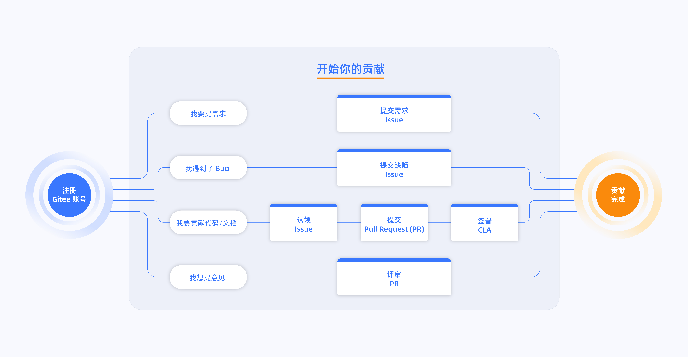

# KWDB项目贡献流程

## 注册Gitee

KWDB的源代码托管在[Gitee（码云）平台](https://gitee.com/kwdb)。请参考[Gitee](https://gitee.com/help/articles/4113#article-header0)注册指南注册您的Gitee账户。了解社区公约，可至[KWDB社区公约](./Code_of_conduct.md)。

## 开始贡献

**提交需求**

KWDB社区中有[Issue列表](https://gitee.com/organizations/kwdb/issues)，如您所关心的需求不在列表中，可在对应仓库上新建需求issue，具体可参考[Issue提交指南](./Issue_submission_guidelines.md)。如您不确定需求属于哪个仓库，可将需求提至[community仓库](https://gitee.com/kwdb/community/tree/master)。

**提交bug**

同样，您可在对应仓库中新建缺陷issue，帮助我们识别项目中的问题，以更好地提升改进，具体可参考[Issue提交指南](./Issue_submission_guidelines.md)。

**认领issue，提交PR**

社区的[Issue列表](https://gitee.com/organizations/kwdb/issues)会持续更新，如您对任何一个open issue感兴趣，可在其评论区添加评论，说明您的修复意向与预计修复时间，系统将尽快反馈该问题分派情况。若认领成功，请开启您的工作，修复后提交PR，并关联对应的issue，PR中包含修复代码及对应测试用例。提交PR前需签署[CLA](https://gitee.com/organizations/kwdb/cla/kwdb-contributor-protocol) （CLA只需在初次提交PR时签署即可）。

**评审PR**

您可至社区[PR列表](https://gitee.com/organizations/kwdb/pull_requests)中，找到感兴趣的PR，贡献您的评审意见。我们非常重视每位贡献者的见解，并期待与大家一起改进KWDB项目。

## 完成贡献
一旦您完成了步骤2中的任一环节，即被视为贡献完成。我们欢迎所有的开发者加入到KWDB社区参与贡献，了解社区角色可至[KWDB社区角色](./Community_roles.md)。