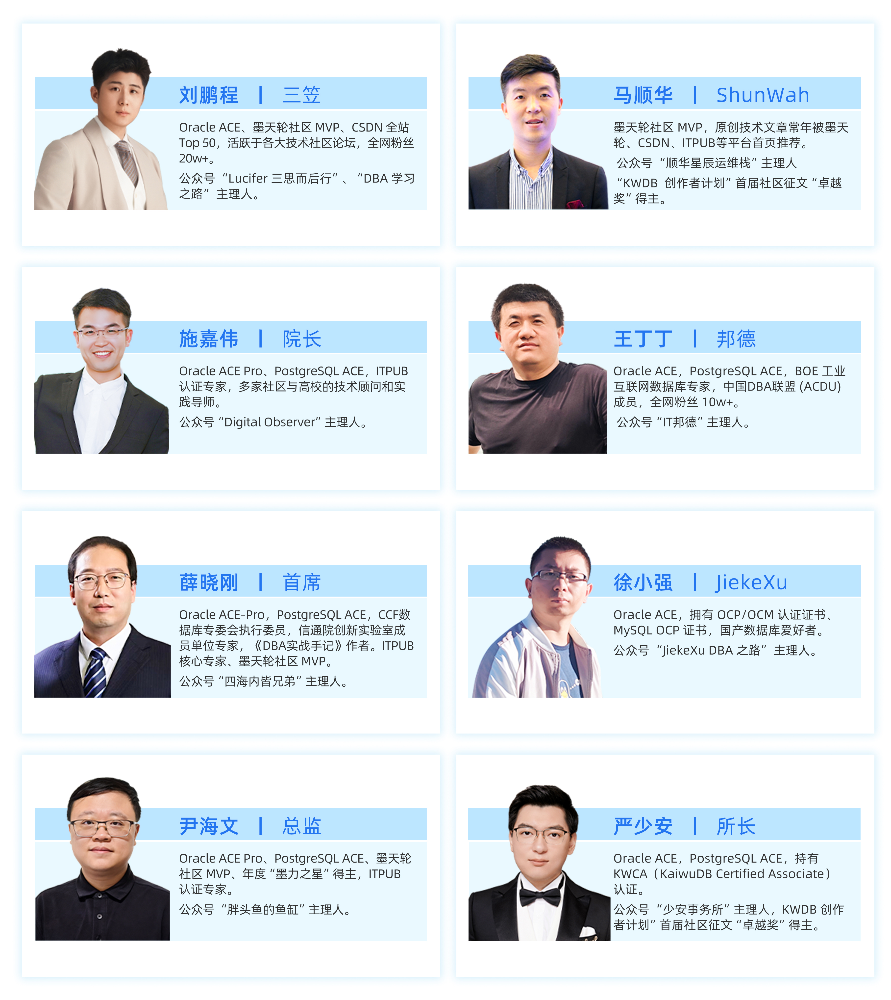

# KWDB MVP:共建多模数据库新生态

在 KWDB 生态建设与技术推进中做出突出贡献的技术专家，凭借对数据库技术及开源技术的深厚热爱，以及在技术分享、社区建设中的积极表现，为 KWDB 开源生态注入了蓬勃活力。

[申请成为 KWDB MVP](https://zzqonnd3sc.feishu.cn/share/base/form/shrcnq6E04iZ7YvfYqYFEovFFmc)

## 2025 KWDB MVP

## 🏅 参与资格要求

1. 技术热忱：对时序数据库、多模数据库及开源技术领域抱有浓厚兴趣，并具备深入研究与实践经验。  
2. 乐于分享：积极通过视频创作、技术博客、行业演讲、代码贡献或社区活动等形式，分享技术见解与实践成果。  
3. 社区活跃：技术社区、开源项目或行业会议中表现活跃的参与者。
4. 社区支持：已加入KWDB官方社区微信群，并积极参与用户问题解答与社区建设。

## 🎁 权益与支持

1. 品牌曝光机会：作为 KWDB 官方认证的专家，你的个人简介、技术成果将在 KWDB 官网、公众号、行业会议等平台展示，提升行业影响力；
2. 定制荣誉认证：颁发 MVP 专属定制证书，彰显技术影响力；  
3. 专属权益保障：
  - 享受社区定制 MVP 礼包； 
  - 包括技术培训课程、行业峰会门票、与行业大咖面对面交流的机会等；
4. 积分兑换权益：开放 MVP 专属积分兑换渠道，可凭积分兑换对应奖品。
