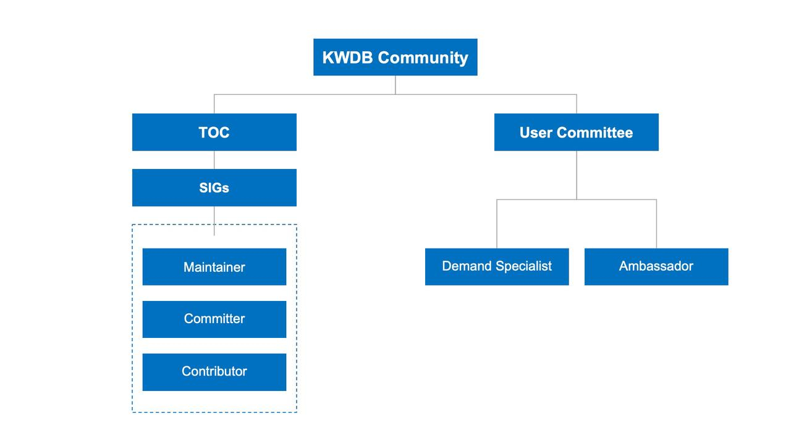

# KWDB Community Guide

Welcome to the KWDB Community!

This repository provides comprehensive information on how our community is organized, managed, and how you can contribute.

## Community Organization

We’re always excited to have developers join and become a part of the KWDB community.

Here are the [roles within our community](./Community_roles.md):

**Technical Oversight Committee (TOC)**: The TOC is the technical leadership team responsible for providing guidance, making decisions, and overseeing the KWDB community. They handle all final technical decisions.

**Special Interest Groups (SIGs)**: SIGs focus on specific technical areas. You can find more about the existing SIGs [here](./SIGs.md).

- **Maintainer**: Maintainers oversee the architecture of their SIGs. They ensure code quality, have the authority to review and merge code, organize regular SIG meetings, represent the SIG in TOC meetings, and take part in major technical decisions for the KWDB project.

- **Committer**: Committers are core contributors to the KWDB project or key developers within a SIG. They also have the authority to review and merge code.

- **Contributor**: Anyone who contributes code or documentation to the KWDB project.

**User Committee**: The User Committee focuses on user needs and feedback. They’re responsible for promoting the project and collecting user feedback.

- **Demand Specialist**: Demand specialists collect, analyze, and communicate user needs within the community.

- **Ambassador**: Ambassadors promote the community and its projects, and assist KWDB users with their inquiries.

## How to Download Resources

### Documentation

You can find the latest community documentation in the community repository. For the most up-to-date KWDB user documentation, visit the [docs repository](https://gitee.com/kwdb/docs). All documentation is available for download.

### Source Code

**Download the Source Code**

If you’re interested in reading or modifying the code, you can download the latest version from the [KWDB repository](https://gitee.com/kwdb/kwdb).

**Download Compiled Binaries**

If you simply want to use the project’s products, you can download the community-compiled binary executable files here.

## How to Contribute

We welcome your contributions to the KWDB community! For details on how to get started, check out our [Contribution Process](./Contribution_process.md).

If you come across any bugs or have any requests while exploring the documentation, reviewing the code, making changes, or using the product, feel free to [submit an issue](./Issue_submission_guidelines.md) to the corresponding repository. If you’re not sure which repository your issue belongs to, feel free to submit it to the community repository.

For feedback or suggestions, please reach us at user@kwdb.org.cn.