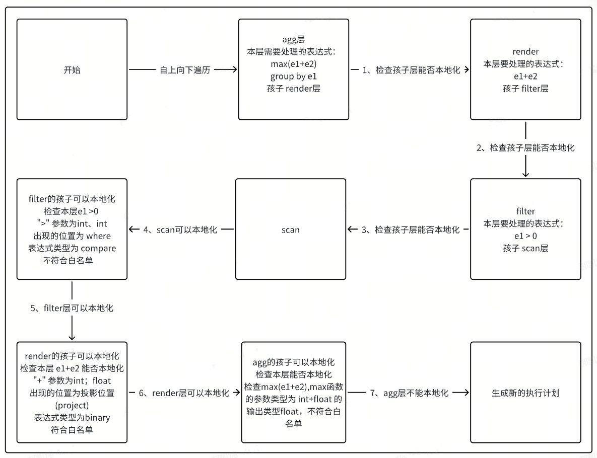

# KWDB SQL编译和优化

## 1. 概述
KWDB是一款 面向 AIoT 场景的分布式多模数据库 产品，支持在同一实例同时建立时序库和关系库并融合处理多模数据，具备千万级设备接入、百万级数据秒级写入、亿级数据秒级读取等时序数据高效处理能力，具有稳定安全、高可用、易运维等特点。

KWDB的SQL引擎由解析器、优化器和执行器组成，编译优化部分主要介绍解析器和优化器。
    
解析器的主要作用是将用户输入的SQL语句转换为KWDB能运行的结构，同时做一些必要的规范性校验。
主要包括词法解析、语法解析和语义解析三个步骤。
    
优化器的主要作用是将解析器生成的结构运用规则和成本的优化进行结构等价互换，再不改变SQL原意的前提下使其效率更高，成本更低。
主要包括RBO优化、CBO优化和多模计算优化等。

## 2 KWDB查询编译和优化基础架构
        KWDB的编译阶段，主要对SQL语句进行三个步骤的处理，分别是词法解析，语法解析和语义解析。在语义解析阶段为了使计划更优，
    KWDB还会对计划进行RBO优化。

### 2.1 词法解析
        KWDB的词法解析会根据yacc文件中定义的词法单元将SQL语句从字符流转换具备词法的词法单元列表tokens，如：关键字、标识符、常  
    量和运算符等。
具体步骤如下：
- 去除注释和空白。
- 识别词法单元：扫描SQL字符流，分解识别词法单元。
- 构建tokens：将识别出的词法单元按照SQL顺序排列，形成列表。

例如有以下查询语句：

    
        SELECT a, b FROM t WHERE c > 30;
    

词法分析的结果如下：

      
    SELECT（关键字）
    a（标识符）
    ,（分隔符）
    b（标识符）
    FROM（关键字）
    t（标识符）
    WHERE（关键字）
    c（标识符）
    >（运算符）
    30（常量）
    ;（分隔符）

### 2.2 语法解析
        KWDB的语法解析会根据yacc文件中定义的语法遍历的对tokens进行识别，判断语法是否存在错误和规约冲突。
无法生成语法树的情况如下：
- 语法错误：在判断需要进行规约（生成语法）时校验失败，如：未定义的语法。
- 移进-规约冲突：无法决定是移入（继续读取token）还是规约（生成语法），通常是因为输入串中的符号可能会匹配多个产生式的右侧。
- 规约-规约冲突：存在多个规约操作的可能性，无法确定应使用哪一个规约规则，存在歧义。

在每次规约都正确完成，直到tokens遍历结束，最终会生成一个抽象语法树AST。

### 2.3 语义解析
        KWDB的语义解析会对查询的语法树AST进行深入的分析，以确保查询在逻辑和语义上是有效的，并且能够正确地执行。
具体操作如下：
- 检查查询是否为SQL语言中的有效语句，其中包括对表和列的存在检查、数据类型检查，权限检查和约束校验等。
- 解析名称，如表名或变量名的值。
- 消除中间运算，如用1.0替换0.5+0.5。此也被成为常数折叠。
- 确定用于中间结果的数据类型，如查询语句中包含子查询时。

此步骤之后生成的计划已经可以转换为执行计划，但此时的计划并非最优计划，后续还需要进行优化。

### 2.3 RBO优化
        RBO(rule based optimization)是基于规则的优化，原理相当于关系代数的等价变换，用效率更优的等价表达式代替原有表达式。  
        其典型的规则有列裁剪、谓词下推、投影消除等。
具体分析如下：
- 列裁剪
 

假设表t有 a、b、c、d四列。

有以下查询语句：

    
        SELECT a FROM t WHERE b > 5;

这条查询可以将t表中的所有数据读取上来，然后根据条件过滤，然后再投影，最后拿到 列（a）的数据。也可以先进行列剪裁，只读取列a，b的数据，然后根据过滤条件进行过滤，最后输出数据。列裁剪可以避免消耗一些不必要的资源。

- 最大最小值消除

有以下查询语句：

    
        SELECT min(a) FROM t;
    

这句话可以转换成：

        SELECT a FROM t ORDER BY a DESC LIMIT 1; 

这样查询的效率要比做聚合要高。

- 投影消除

假设表t和tt均有a、b、c、d四列。

    

有以下查询语句：

        SELECT t1.a t2.b FROM t AS t1 JOIN (SELECT a, b, c FROM tt) AS t2 ON t1.a=t2.a;

此查询语句投影列中只需要表t的a列和表tt的b列，而join的右侧子查询的投影列存在a、b、c三列，c列在外层是不需要的，所以计划中会消除掉c列。

- 谓词下推

有以下查询语句：

        SELECT * FROM t, tt WHERE t.a > 3 AND tt.b < 5;

假设t、tt均有100条数据，如果先将t和tt做笛卡尔积在过滤就要处理10000条数据，如果能先做谓词条件过滤(将每张表的过滤条件下推到select计算中)，那么数据量可能会大量减少。例如符合t.a > 3条件的t表数据有10条，符合tt.b < 5的tt表数据有8条，先过滤之后再做笛卡尔积只需要处理80条。

    
谓词下推就是将过滤条件尽量靠近叶子节点。

经过RBO优化过的计划会比未优化过的计划性能效率更高，性能更好，成本更低。

至此RBO优化介绍完毕，KWDB还会对SQL进行更加深入的CBO优化和多模场景的计算优化，请参考3、4章节。

## 3 针对多模计算的优化

### 3.1 KWDB多模计算本地化

#### 3.1.1 计算本地化概念
将query尽可能的放到时序引擎内去执行，这样可以减少数据传输，使数据尽可能的本地处理，提高查询的效率，这个找到时序引擎支持的最大的计划树的过程我们称之为计算本地化。
#### 3.1.2 计算本地化的基本思路
query语句会被语法解析器解析为一颗树状结构的表达式，每一层表达式后续会转换为对应的算子由执行引擎执行。这个树状结构我们称之为 memo tree。在构建memo tree的过程中，需要对一些标量表达式进行评估和处理，如filter。 在memo tree基本构建完毕后，需要自顶向下的遍历这棵树，找出可以在时序引擎本地化计算的最大树。
#### 3.1.3 每层针对计算本地化的处理
    1. 对于scan层: 时序的scan全部在时序引擎执行计算本地化。
    2. 对于filter层：
          1、需要对filter表达式进行拆解，判断哪些filter条件能实现计算本地化和
             哪些filter条件不能实现计算本地化并记录
          2、对记录结果进行一系列运算获取最终需要进行计算本地化的filter集合
          3、将能实现计算本地化的部分作为一个过滤算子放到时序引擎执行
          4、关系引擎根据不能实现计算本地化的部分重新构建新的filter层
          5、关系接收时序filter处理后的数据并再做过滤
          这样就完成了filter层的计算本地化处理
    3. 对于group层：
          GroupBy、ScalarGroupBy、Distinct逻辑一致
          下面先解释一下这个三个名词。
          GroupBy： 查询有聚合函数且有 group by
          ScalarGroupBy: 查询只有聚合函数，没有group by
          DistinctOnExpr：查询只有group by，没有聚合函数
          group层的本地化计算需要判断2处能否实现计算本地化
          1、group by 检查group by 列能否实现计算本地化
          2、聚合检查聚合函数、聚合函数输入(包括类型、个数等)、
             以及聚合函数运算等能否实现计算本地化。
          如果是ScalarGroupBy 层则不需要检查 条件1
          如果是distnctOnExpr 层则不需要检查 条件2
          本层不能拆分，有一处检查不能本地化计算则group by层不能本地化计算。
    4. 对于projection层：
          处理projection时，会检查本层projection操作能否实现计算本地化。
          如投影列不能出现 int + float，否则时序引擎不支持等。
          只要出现不能进行计算本地化的情况，则本层不做结算本地化处理。
    5. 对于limit层
          limit层可以在时序引擎使用计算本地化处理，
          只是多结点时需要网关结点二次limit汇聚结果
    6. 其他层
          其他算子暂未实现，如join表达式还未在时序引擎支持结算本地化。
          后续版本逐渐支持。
#### 3.1.4 计算本地化控制
    我们希望通过一个灵活的、可调整的机制去控制各个层的计算本地化判断。下面介绍一个控制计算本地化的机制：本地化计算白名单。
##### 3.1.4.1 本地化计算白名单
本地化计算白名单，一个用于控制表达式能否进行本地化计算的名单，具体形式为一张系统表。他记录了时序引擎支持的所有表达式，白名单由下列元素构成：可本地化执行操作、参数数量、参数类型、可本地化执行位置、默认是否开启、支持类型。

    下面解释一下各个元素
    1、可本地化执行操作：表示这个表达式的操作符能否在时序引擎本地化计算
    2、参数数量：表示这个表达式的参数数量
    3、参数类型：表示这个表达式的参数类型，可以表示多个参数的类型，是一个数组
    4、可本地化计算位置：表示这个表达式在query中出现的位置
    5、默认是否开启：默认是否可以本地化计算，可手动变更
    6、支持类型：支持表达式的类型，如const、column、agg、bianary、compare

下面是一个白名单的例子：
| 可本地化计算操作符或函数 | 参数数量 | 参数类型 | 可本地化计算位置 | 默认是否开启 | 支持类型 |
|---|---|---|---|---|---|
| + | 2 | int;int | where | true | 常量; 列类型 |

    在这个例子中，白名单允许满足某些条件的 “+” 操作符的表达式进行本地化计算机，“+”操作符满足以下条件时，可以通过本地化计算实现
      1. “+” 操作符的参数数量为2，即左右参数
      2. “+” 操作符的参数数类型为：左参数类型为int，右参数类型为int
      3. “+” 操作符出现在where条件中
      4. “+” 操作符的结果为一个常量或列类型
##### 3.1.4.2 利用白名单控制计算本地化
    下面介绍下如何判定这个表达式在白名单中。
  1. 白名单中的每一行代表一个可本地化计算的表达式，根据表达式的操作符(或函数)名称、参数个数、
     参数类型做一个哈希编码（hash code）。
  2. 将这个hash编码作为key，允许出现的位置、表达式的输出类型作为 value，放到一个map中。
  3. 要检查某一层的表达式能否本地化计算时，先根据表达式的操作符、参数个数、参数类型做一个哈希编码，
     得到一个hash code。用这个hash code去map中取值。
  4. 如果能取到值，再校验可以出现的位置和表达式的输出类型是否能本地化计算，这个信息存放于map的value中。
  5. 按照上述步骤检查表达式，如果满足条件则说明白名单允许这个表达式进行本地化计算。
#### 3.1.5 本地化计算判断举例说明
    下面介绍一个例子判断计算本地化的过程。
    如 select max(e1+e2) from d1.t1 where e1 > 0 group by e1; 其中 e1列为int类型、e2列为float类型。
    
假设我们的白名单是这样的
|可本地化计算操作符或函数|参数数量|参数类型|可本地化计算位置|默认是否开启|支持类型|
|---|---|---|---|---|---|
|max|1|int|投影列|true|常量;列类型|
|+|2|int;float|所有位置|true|所有类型(包括Const、Column、Binary、Compare、Agg)|
|>|2|int;int|where|true|所有类型|

    首先，这个query 生成的memo tree是这样的。

    下图是这棵memo tree的本地化计算流程。                                  

#### 3.1.6 本地化计算主要逻辑入口
    1. CheckWhiteListAndAddSynchronize 本地化计算逻辑的入口
    2. CheckWhiteListAndAddSynchronizeImp 本地化计算逻辑的主体，检查每一层算子能否本地化计算，其中包含检查每一层的函数
    3. CheckExprCanExecInTSEngine 判断本层表达式是否能由时序引擎本地化计算
    4. SetAddSynchronizer 给本层加并发标记。
    使用时序本地化计算的算子支持并发，所以找到可以本地化计算的最大树后，会加上可以并发的标记，以供时序引擎执行并发
### 3.2 统计信息和CBO
查询优化器部分采用基于成本的优化器，使用统计信息来评估不同查询计划的预期成本，并选择成本最低的执行计划。查询优化的主要流程如图所示：
.png)
#### 3.2.1 统计信息
统计信息作为查询优化器的数据源，统计信息的收集过程如图所示：
.png)
- TableReader: 表读取器，对表数据进行读取。
- TsSampler：样本采样器，统计表级统计信息，以及输入列的样本和基数。
- SampleAggregator: 采样汇总器，聚合来自多个采样器的结果，并将统计信息持久化存储。
#### 3.2.2 开销模型
开销模型由不同种操作类型的开销计算公式函数组成，在优化器中的主要行为包括：
- 对于传入的候选表达式，基于逻辑表达式树中的统计信息，对实际执行代价进行一个估计。
- 将估计代价分配给对应的表达式中，如果候选表达式的成本低于memo中的其他任何表达式，则它将成为该组的最佳新表达式。

Costor.go中以ComputeCost为主函数入口展开，调用了相应的对象和其对应的函数来估算出表达式的执行代价。
#### 3.2.3 计划列举
- 查询优化器采用Cascades框架，自顶向下进行优化
- 在CBO初始阶段，将AST转化为一个规范化（normalized）计划
- 计划列举依次枚举所有与规范化计划等价的表达式，并估算每个表达式的代价
- 最后输出估算代价最小的计划，即最优计划

以下举例说明：
.png)
### 3.3 总结
本文概述了KWDB在查询优化和编译方面的宏观流程，以及结合多模引擎所做的延展和优化。KWDB项目本身仍在快速迭代中，欢迎大家到KWDB代码库中了解该领域最新的功能和创新。