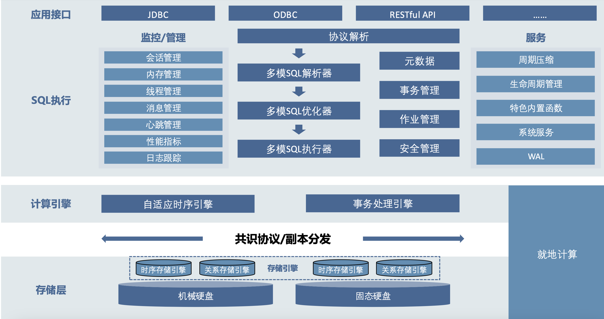
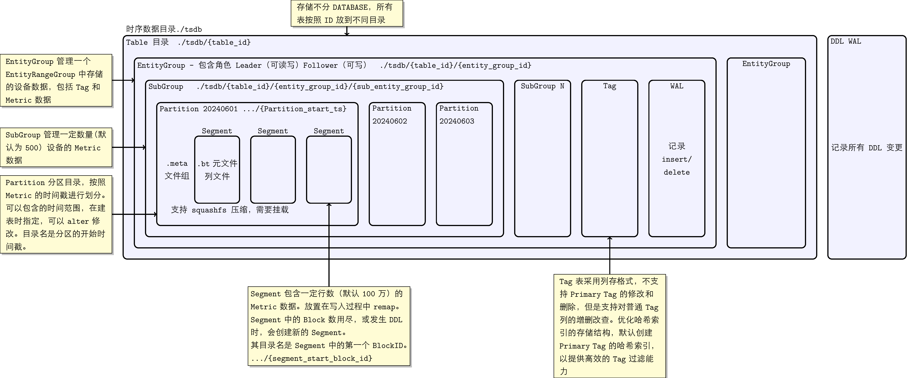
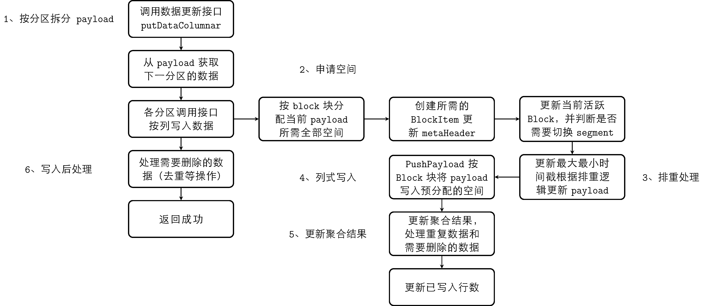
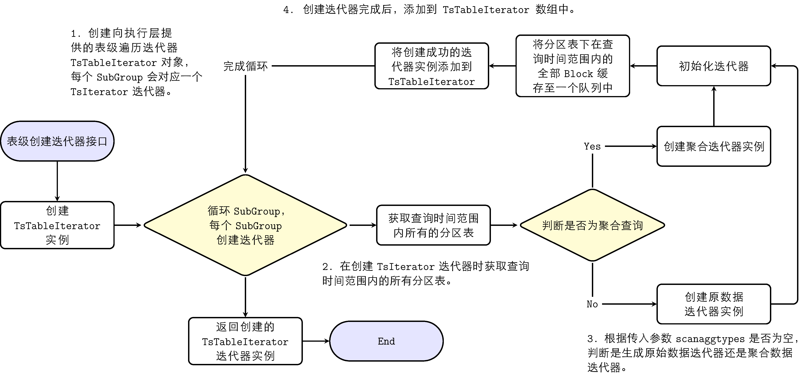
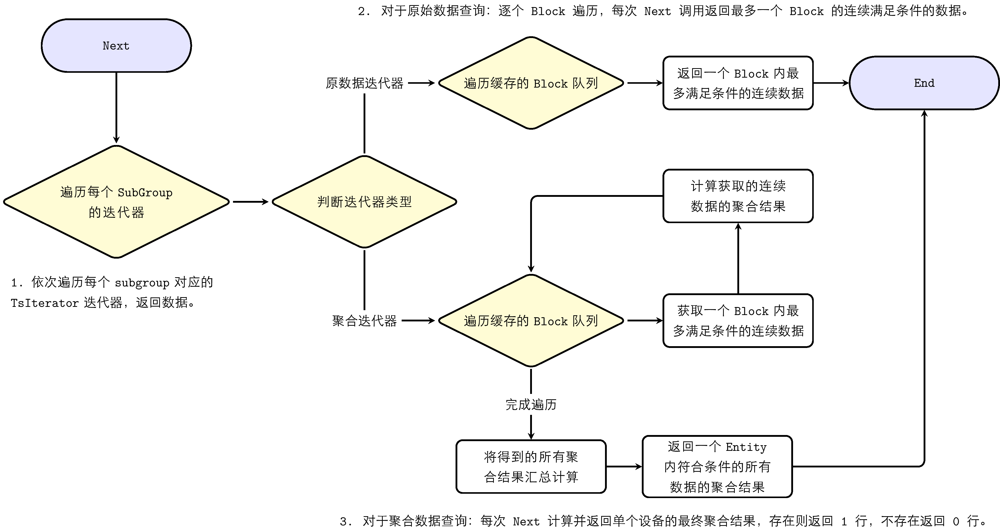
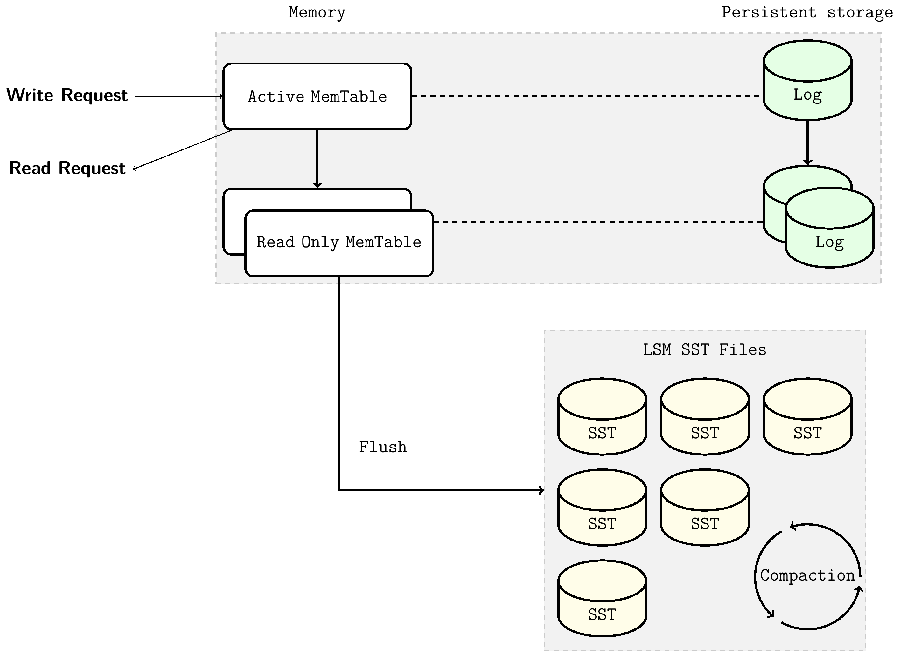
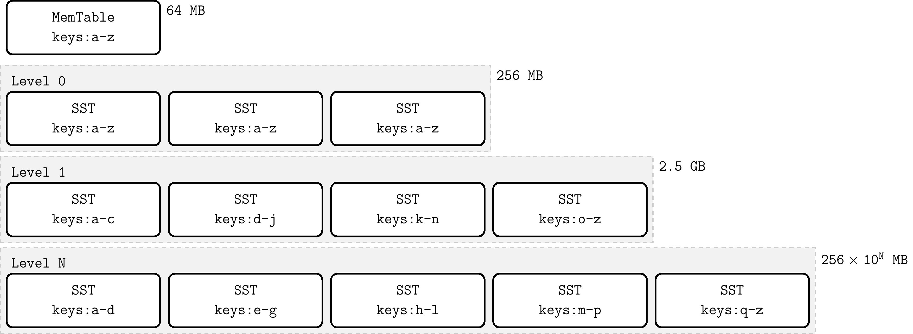
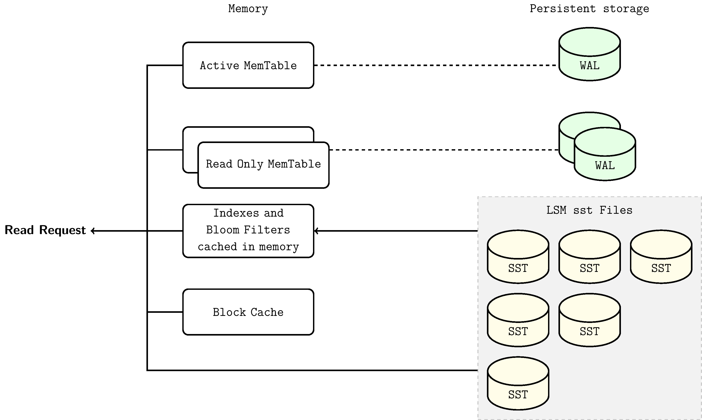

# KWDB存储模块架构介绍

## 1. KWDB存储系统

KWDB 是一款面向 AIoT 场景的分布式、多模融合、支持原生 AI 的数据库产品，支持同一实例同时建立时序库和关系库并融合处理多模数据，具备千万级设备接入、百万级数据秒级写入、亿级数据秒级读取等时序数据高效处理能力，提供一站式数据存储、管理与分析的基座。KWDB 的多模特性是其核心优势之一，主要体现在以下几个方面：

1. **多模融合**：KWDB 支持在同一实例中同时建立时序库和关系库，实现多模数据的融合处理。这种设计允许用户在单一数据库系统中处理不同类型的数据，简化了数据管理的复杂性。
2. **统一数据接口**：通过内置的通用数据模型，KWDB 提供统一的数据接口，支持不同数据模型的融合处理。这意味着用户可以使用统一的查询语言和接口来操作时序数据和关系数据，提高了开发效率和数据操作的灵活性。
3. **时序数据处理优化**：面向物联网场景，KWDB 推出了“时序表”功能，专门针对海量时序数据的读写性能进行优化。这使得数据库能够处理百万级数据的秒级写入和亿级数据的秒级查询，满足高速数据入库和极速查询的需求。

KWDB一致可靠的数据持久化离不开底层存储引擎的支持。由于关系库与时序库服务于不同的数据使用场景，因此需要不同的存储引擎来针对性地优化性能。时序库主要处理按时间顺序记录的数据，通常以连续的方式写入，具有高度的时间相关性。时序存储引擎被设计为能够快速处理大量顺序写入的数据。相对地，关系数据库需要处理复杂的数据结构和多样化的查询请求，包括多表关联和随机读写操作。这要求关系存储引擎能够支持高效的数据检索、更新和事务处理，同时保持数据的完整性和一致性。

## 2. KWDB时序存储引擎架构

KWDB 采用了自主研发的时序存储引擎，专为工业物联网设备产生的时序数据进行了深度优化。在时序数据的应用场景中，一个显著的特点是数据的写入频率远远超过读取频率，这与传统的关系型数据管理有着本质的区别。针对时序数据场景，KWDB采用列式存储架构，其中每列数据被独立存储于各自的文件中。这种列式存储方式具备多项优势：1、减少I/O，2、提高CPU缓存性能，3、提高压缩效率，4、支持向量处理。列式存储的这些优点非常适合于时序场景。

KWDB时序引擎使用内存映射(mmap)技术对这些持久化列存数据文件进行读写。mmap通过将文件内容直接映射到进程的地址空间，减少了数据在用户空间和内核空间之间的拷贝，实现了文件I/O操作的高效性。mmap利用操作系统的页缓存机制来优化文件访问，提高了数据访问的速度和一致性，同时减少了内存的使用。mmap在处理大型文件和需要高效文件共享的场景中尤为有用。这正是时序数据库所面对的场景。

### 2.1 存储目录结构

KWDB 底层时序存储通过时间分区进行数据分组管理，方便快速通过时间过滤查询；采用列存结构，保证优秀的压缩效果和查询性能。时序存储引擎将所有数据存放在目录`./tsdb`下。在存储模块中，所有时序表不区分库，按照table_id放到不同的子目录中。每个表内自顶向下按照EntityGroup、SubEntityGroup、Partition、Segment、Block来组织时序数据以及标签（tag）。

- **EntityGroup：** 存储层的 EntityGroup 是相对独立的一个物理单元，是一个时序表水平切分的分片。一个 EntityGroup 内部包含完整的 Tag 表数据和 Metrics 数据。在存储目录层级上使用独立的目录存放一个 EntityGroup 的全部数据。
  
- **SubEntityGroup：** SubEntityGroup 是为了平衡元数据的空间占用及设备（Entity）查询性能问题引入的概念：元数据 MetaBlock 是预分配的，如果数量预留过大而实际使用量少会造成空间浪费，而大量的 Entity 查找也会消耗查询性能。因此我们可通过系统参数设置每个 SubEntityGroup 最多可存储的 Entity 数量。SubEntityGroup 不是完全独立的存储单元，一个 EntityGroup 内的多个 SubEntityGroup 都是共用一个 Tag 表。

- **Partition：** 数据分区目录，按照 Metric 的时间戳进行划分。支持按照时序表级的时间分区管理，不同时序表可以有不同的时间分区参数。时序表的时间分区间隔支持动态修改：旧数据的时间分区不变（包括新写入旧时间分区的数据），新时间戳的数据按照新的时间分区间隔计算分区时间。
- **Segment：** 每个 SubEntityGroup 中可能包含多个 Segment，因为存储数据不再进行 remap，所以需要在最开始的时候按照一定的行数初始化每列数据，这个固定的行数（默认 100万）的一组列文件，会放到一个文件夹下，称为一个 Segment。

- **Data Block：** 列文件中按照固定行数管理同一设备的数据块。Block中除了包含固定行数对应列的值，也包含一些值的聚合结果，比如最大值、最小值、非NULL值总数、NULL BitMap等。

- **.meta文件：** 记录了所管理Entity的Data Block的元信息文件，包含多组Block Item。

- **Block Item：** 为了访问Data Block所记录的Block元信息，包含Block所在的链表位置、已写入行数、已删除行的Bitmap等内容。
- **Tag/Primary Tag：** tag是时序场景下某一组设备具有的固定属性。tag可分为普通tag和primary tag，primary tag是tag列中可以唯一标识一组设备的列。
- **WAL：** 即用于数据一致性的预写日志，分为两类。一是在`tsdb/wal`目录下的WAL，用于存储DDL级别的WAL。比如表结构的变更，比如增加或删除某个表的列和标签。二是在EntityGroup目录下的WAL文件，用于存储DML级别的WAL。比如对某行数据的插入删除等操作。
  
时序**存储特点**：

1. 时序存储会根据设备的 Primary Tag 拆分到不同 SubEntityGroup 中。
2. 随着时序数据的写入，会按照数据写入时间，写入不同的分区 Partition 目录。
3. 支持历史分区的写入、导入。
4. 通常在使用mmap读写文件时，由于文件扩容需要 remap，需要对读写进行加锁。为了减少读写锁冲突，提高性能，分区中通过 Segment 管理预留空间，默认存储 100万行（可配置）数据，Segment中数据的读写是无锁的。
5. sqfs 压缩是以 Segment 为单位进行，读取 sqfs 文件需要 mount。目前支持 LAZY mount、LRU umount，整个 Engine 默认配置 1000 个 Segment 挂载点，超过 1000 个且无使用的 Segment 会被 umount 掉。

### 2.2 数据读写流程

时序引擎的数据读写采用了`mmap`内存映射技术，将持久化数据文件直接映射进内存，此时对映射内存的操作等价于对文件的操作。相比于传统IO系统调用`read, write`，`mmap`可有效避免读写过程中的数据拷贝以及用户态与内核态之间的上下文切换，因此通过`mmap`实现文件读写比使用I/O系统调用在读写文件上更加高效。

KWDB时序存储引擎在设计之初，通过分析物联网时序场景大部分为顺序写入、删除少等特点。为了达到极致的数据写入性能，采取了写入不排序、读取排序、标记删除等方案。同时为了支持乱序读写，实现了存储小范围排序读取功能，减少乱序数据读取的性能损耗。同时也支持定期数据排序重组，从而保证了历史数据的有序存储，也可以对已删除行数据、已删除列数据进行清理。

#### 2.2.1数据写入

存储采用列式存储，通过 .meta 文件作为索引管理 Data Block，.meta 文件负责存储所有 Entity 的 BlockItem，BlockItem ID 加锁顺序递增，和 Block ID 一一对应。通过链表方式找到 BlockItem 即可计算定位在 Data Block 的文件偏移位置，写入的数据会追加到 DataBlock 中。时序数据写入的基本流程图如下：

1. 按照时间分区拆分执行层提供的payload
2. 每个分区按Block块分配拆分后payload所需全部空间
3. 根据排重规则进行排重处理
4. 列式写入，按block块将payload写入预分配的空间
5. 更新Block中保存的聚合结果
6. 写入后处理，处理需要删除的数据

存储支持相同时间戳下多条数据的写入去重，可以通过 CLUSTER SETTING 设置集群级去重规则。去重逻辑的实现是将之前写入的重复时间戳的数据进行标记删除。因为去重逻辑涉及查询，所以对于大部分顺序场景进行了优化。数据时间分区中会记录所存储数据的最小和最大时间戳，根据时间戳进行判断是否是顺序写入，如果是顺序写入的数据，不会走入去重逻辑。

**目前实现的排重规则：**

1. Override：同一个 Entity 的相同时间戳数据，会进行整行覆盖。即保留新的，删除旧的。默认配置。
2. Merge：同一个 Entity 的相同时间戳数据，会进行部分列合并去重。保留非 NULL 并且是最新的值。
3. Discard：忽略新插入的记录，保留原有记录。

#### 2.2.2数据查询

数据查询的流程是创建迭代器，通过迭代器的 Next 接口获取数据。创建迭代器流程如下：

1. 创建向执行层提供的表级遍历迭代器 TsTableIterator 对象，每个 subgroup 会对应一个 TsIterator 迭代器。
2. 在创建 TsIterator 迭代器时获取查询时间范围内的所有分区表。
3. 判断查询是否为聚合查询来决定是生成原始数据迭代器还是聚合迭代器。
4. 创建 TsIterator 完成后，添加到 TsTableIterator 数组中。

通过GetIterator得到的迭代器对象可通过Next方法对数据进行遍历，迭代器 `Next` 流程为：

1. 依次遍历每个 subgroup 对应的 TsIterator 迭代器，返回数据。
2. 对于原始数据查询：逐个 Block 遍历，每次 Next 调用返回最多一个 Block 的连续满足条件的数据。
3. 对于聚合数据查询：每次 Next 计算并返回单个设备的最终聚合结果，存在则返回 1 行，不存在返回 0 行。
4. 聚合结果返回的值：对于整数结果会返回为 INT64，溢出则返回为 Double；浮点结果统一返回为 Double。

## 3. KWDB关系存储引擎架构

KWDB底层的关系库存储引擎，是基于RocksDB的Key/Value模式。RocksDB 是一种可持久化的、内嵌型key-value存储引擎。它是为了存储大量的 key 及其对应 value 设计出来的存储引擎。 key 和 value 是任意长度的字节数组（byte array），因此都是没有类型的。本质上来说，关系存储引擎就是维护一个key-value集合，再此集合上进行增删改查。存储引擎为此提供了几个用于修改 key-value 集合的函数底层接口：

1. `put(key, value)`：插入新的键值对或更新已有键值对
2. `delete(key, value)`：从集合中删除键值对
3. `get(key, value)`：通过key来查找所关联的value

实际的生产环境中会经常遇到庞大的键值对集合，其规模之大往往超出了内存的承载能力，导致大多数键值对必须被持久化存储在硬盘上。为了高效地管理这些数据，存储引擎必须采用一种高效的数据结构，以最小化在更新键值对时对磁盘的访问次数。LSM-Tree（Log-Structured Merge-Tree）正是这样一种优化数据结构，它通过智能地组织键值对来减少对磁盘I/O操作。

### 3.1 3.1 存储目录结构：LSM树

LSM Tree也被称为日志结构合并树，它是一种树形的数据结构，每层的数据按 key 有序。LSM-Tree 的最高层保存在内存中，包含最近写入的数据。其他较低层级的数据存储在磁盘上，层数编号从 0 到 N 。第 0 层 L0 存储从内存移动到磁盘上的数据，第 1 层及以下层级则存储更老的数据。通常某层的下个层级在数据量上会比该层大一个数量级，当某层数据量变得过大时，会合并到下一层。在RocksDB中，顶层的内存树节点被命名为MemTable，持久化到磁盘的树节点以文件的形式存在，被命名为SSTable。下面分别进行介绍。

#### MemTable

MemTable 是一个内存缓冲区，在键值对写入磁盘之前，Memtable 会缓存住这些键值对。所有插入、删除和更新操作都会首先更新MemTable。MemTable 具有可配置的字节数限制。当一个 MemTable 达到其配置的字节数限制时，那么这个 MemTable 将变为不可修改状态，同时会新建立一个Memtable以缓存后续的键值对更新。MemTable 的默认大小为 64 MB。不可修改的MemTable将由后台线程落盘成为持久化的SST文件。为了查询的高效性，MemTable需要有序数据结构实现。在RocksDB中MemTable默认以跳表SkipList数据结构实现。

#### SSTFile

SST 是 Static Sorted Table 的缩写。SST 文件中包含从不可变 MemTable 刷盘而来的键值对。由于Memtable始终保持键值有序，落盘后的SSTFile同样也保持有序性。SSTFile是一种基于块的文件格式，会将数据切成固定大小的块（默认为 4KB）进行存储。RocksDB 支持各种压缩 SST 文件的压缩算法，例如 Zlib、BZ2、Snappy、LZ4 或 ZSTD 算法。与 WAL 的记录类似，每个数据块中都包含用于检测数据是否损坏的校验和。每次从磁盘读取数据时，RocksDB 都会使用这些校验和进行校验。

SST 文件主要由数据块和meta块两部分组成。meta块记录了诸如布隆过滤器、索引、压缩词典等非键值对数据信息。虽然 SST 中的键值对是有序的，也并非总能进行二分查找，尤其是数据块被压缩过后，直接访问数据块会使得查找很低效。RocksDB 使用索引来优化查询，存储在紧邻数据块之后的索引块。Index 会把每个 数据块中最后一个 key 映射到它在磁盘上的对应偏移量。同样地，index 中的 key 也是有序的，因此我们可以通过对index的二分搜索快速找到某个 key所对应的块。

### 3.2 数据读写流程

#### 3.2.1 数据写入

数据写入时首先写入内存中的 Memtable，Memtable 维护的数据结构保证插入后整个 Memtable 仍保持有序。同时，对Memtable的写入操作会同步更新到日志文件中（WAL，在下面介绍）。当Memtable写满后，变为不可变Memtable，由后台线程将不可变Memtable刷盘成为磁盘上的L0层SSTable文件。随着数据不断写入，MemTable 不断被刷到磁盘，L0 层上的 SST 文件数量也在增长。当L0层的SST文件数量达到预设值时，会触发Compaction机制以保证每层的SST文件数或者总文件大小不超过预设值。关于Compaction机制的介绍见第2.2.1.2小节。

##### 3.2.1.1 预写日志（WAL）机制

基于Memtable-SSTFile的LSMTree在数据库稳定运行时可高效处理键值对的读写。但一个合格的存储引擎应该具备容灾功能，即无论是在进程意外崩溃退出还是计划内重启时，都应保证不丢失写入的数据。由于Memtable存储在内存中，具有易失性，这需要在对Memtable更新时同时将更新写入到磁盘上的预写日志（WAL，Write-ahead log）中。这样，在重启后，数据库可以通过回溯WAL，进而恢复 MemTable 在重启前的原始状态。当WAL对应的Memtable刷盘成SSTFile后，此WAL将会被删除。

WAL 是一个只允许追加的文件，包含一组更改记录序列。每个记录包含键值对、记录类型（Put / Merge / Delete）和校验和（checksum）。与 MemTable 不同，在 WAL 中，记录不按 key 有序，而是按照请求到来的顺序被追加到 WAL 中。

Compaction 会将某层的 SST 文件同下一层的 SST 文件合并，并在这个过程中丢弃已删除和被覆盖的无效 key。Compaction 会在后台专用的线程池中运行，从而保证了 RocksDB 可以在做 Compaction 时能够正常处理用户的读写请求。

当 L0 层上的 SST 文件数量达到一定阈值（默认为 4）时，将触发 Compaction。对于 L1 层及以下层级，当整个层级的 SST 文件总大小超过配置的目标大小时，会触发 Compaction 。当这种情况发生时，可能会触发 L1 到 L2 层的 Compaction。从而，从 L0 到 L1 层的 Compaction 可能会引发一直到最底层级联 Compaction。在 Compaction 完成之后，RocksDB 会更新元数据并从磁盘中删除已经被 Compcated 过的文件。

#### 3.2.2 数据查询

在LSM-Tree这种有序的数据结构下，查询某个key只需只需自顶向下遍历逐层访问对应的树结点即可。查找首先从 MemTable 开始，下探到 L0，然后继续向更低层级查找，直到找到该 key 或者检查完可能的 SST 文件为止。
以下是查找步骤：

1. 检索 MemTable
2. 检索不可变 MemTables
3. 搜索最近 flush 过的 L0 层中的所有 SST 文件
4. 对于 L1 层及以下层级，首先找到可能包含该 key 的单个 SST 文件，然后在文件内进行搜索

而对SST文件的搜索的步骤如下：

1. 使用布隆过滤器来判断该key是否在此文件中（可选）
2. 查找 index block 来找到可能包含该 key 的 block 所在位置
3. 读取 data block 并尝试在其中找到该 key

